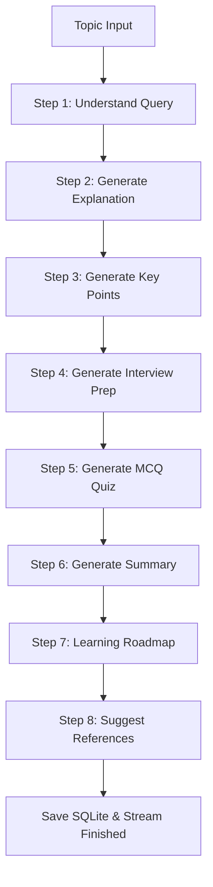

# Project Report - AI Research Assistant Agent

## 1. Overview
The **AI Research Assistant Agent** is a full-stack educational and technical research tool. Built using Python Flask, SQLite, and Vanilla HTML/CSS/JS, the project integrates the Google Gemini API to construct comprehensive, structured learning resources on any topic. 

The application utilizes a **glassmorphism styling system** with dark and light themes, dynamic activity trackers, interactive assessments, a chatbot assistant, and automated PDF export documents.

---

## 2. Generative AI vs. Agentic AI Concepts

A key objective of this project is demonstrating the difference between traditional Generative AI and advanced Agentic AI workflows:

### Generative AI
Generative AI refers to algorithms (such as Large Language Models) that take a prompt and generate novel content (text, images, or code) in response. In this project, individual prompt blocks are structured to ask Gemini to explain a term, construct MCQs, or formulate a learning roadmap.

### Agentic AI
Agentic AI moves beyond static generation to act as an **autonomous agent** executing a multi-step workflow. In this app, the agent takes a single user topic and:
1. Orchestrates a sequence of 8 distinct tasks.
2. Feeds output from previous steps as context into subsequent prompts (e.g., passing the generated technical explanation to build relevant interview prep questions and quiz items).
3. Adapts the stream flow to handle API constraints or fallback configurations safely.
4. Acts as a contextual chatbot, recalling the report details when responding to follow-up questions.

---

## 3. The 8-Step Agentic Workflow

When the agent receives a topic, it triggers the following sequential steps via a Server-Sent Events (SSE) connection:

1. **Understand Query:** Parses search terms, identifies main technical domains, and validates intent.
2. **Generate Explanation:** Compiles an in-depth, structured conceptual write-up.
3. **Generate Key Points:** Extracts 5 high-impact bulleted takeaways from the explanation.
4. **Generate Interview Prep:** Formulates typical technical interview questions and answers.
5. **Generate MCQ Quiz:** Produces multiple-choice questions with answer keys and logic.
6. **Generate Summary:** Creates a high-level executive summary of the entire study.
7. **Generate Learning Roadmap:** Outlines a structured learning guide across multiple skill levels.
8. **Suggest References:** Recommends educational books, documentation, or portals.

---

## 4. Architectural Design (MVC Pattern)

The project adheres to a clean Model-View-Controller structure:

* **Models (Database Layer):** Managed inside `database.py`. It establishes the schema configuration in SQLite and executes statements to set up tables.
* **Views (Template Layer):** HTML templates in `templates/` utilizing Jinja2 template inheritance. Linked to `style.css` which houses styling variables, themes, animations, and responsiveness.
* **Controllers (Route Layer):** Segregated into Flask blueprints inside `routes/`:
  - `auth.py`: Directs authentication workflows and user sessions.
  - `dashboard.py`: Computes statistics and delivers history lists.
  - `agent.py`: Coordinates the SSE agent runner stream, chatbot follow-ups, and PDF packaging.
* **Services (Business Logic Layer):**
  - `ai_service.py`: Performs prompt engineering and handles mock fallbacks.
  - `pdf_service.py`: Processes ReportLab documents with custom styling and page counts.

---

## 5. Technical Highlights

### Server-Sent Events (SSE) Streaming
To avoid request timeouts and keep the user interface responsive, the agent execution uses SSE. The frontend initiates a single HTTP stream request. The Flask backend runs steps sequentially and yields JSON segments in real-time. JavaScript listens to these events, fills the progress bar, and builds the report contents dynamically.

### Interactive Quizzes
The quiz output is returned from Gemini in JSON format, which the frontend parses and builds into interactive buttons. Users select options to see instant color-coded feedback (Green/Correct, Red/Incorrect) and toggle explanation cards.

### ReportLab Dual-Pass PDF Generation
To calculate exact total page counts ("Page X of Y"), a custom `NumberedCanvas` is implemented. It intercepts standard PDF build canvas calls, registers page layouts, and prints standard headers and footers on the second pass. HTML markup is cleaned using regex to guarantee the ReportLab layout engine does not crash.
